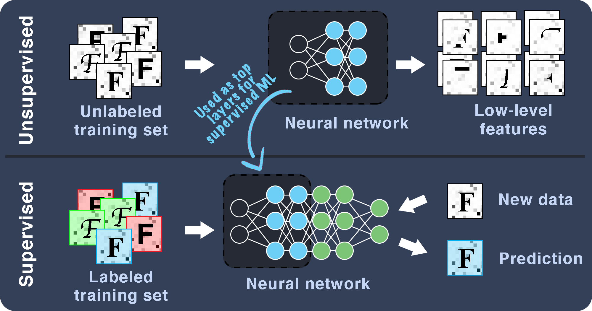



_**The style of texts also carries imformation.**_

## Project Introduction
OCR (optical character recognition) technology that converts images and scanned documents into text is mature with a high accuracy. It is also widely accessible to the public as being embedded in software such as Adobe Acrobat. For converting the scanned documents to text, it is shown that recognizing individual letters [1] rather than words is efficient. Letters can have different font families in a  document. However, the font information is not preserved during the letter recognition process, meaning users need to reformat the document from the scratch. This is inconvenient and can possibly introduce human errors in editing. Thus, we propose to use both supervised and unsupervised machine learning to recognize and distinguish typefaces of characters in scanned documents.
	
Meanwhile, there are apps that specifically target the font recognitions. For example, the app WhatTheFont uses deep learning algorithm trained on 33 million images to recognize 100 thousand fonts [2]. However, the app is tailored towards scanned documents, and for cases where we tested hand-drawn texts, the app will return similar handwritten fonts (thanks to its large collection) instead of similar standard publication fonts that are ready for production. In this sense, the large collection actually hinders people's ability to fast-prototype using pen and paper. To empower artists, designers and editors, we are also proposing to use our trained program for matching the hand-drawn texts with standard fonts.

## Proposed Method

The training sets consist of numbers of computer generated images of characters (A-to-Z) with different typefaces. This enables collecting a large amount of samples efficiently. To mimic the real-life data, which are scanned characters, random Gaussian noises will be added to generate the degraded letter stimuli [1]. (Note that even though the training sets are software-generated, real-life data will be used to characterize the performance of the program.)

Both supervised and unsupervised methods are proposed following the guidance of DEEPFONT [3,4]. A convolutional neural net consisting of unsupervised and supervised portions will be used. The unsupervised neural network will be used to derive low-level feature information from an unlabeled data set. The supervised neural network will use the low-level features to classify labeled fonts.

Due to the complexity of the task, we will only be training on 10 distinct font types.

## Anticipated Results

While computer generated images of characters in different typefaces (with noises and minor distortions) are used in the training phase, the final goal is to recognize or distinguish at least 10 typefaces from real-life images of characters taken from scanned documents.

- After a combination of unsupervised and supervised learning, we expect the program to be able to give predictions of the typefaces of scanned images of charaters.

- The program should also be able to match hand-drawn characters with similar typefaces.

- High accuracies of both programs are expected. However, the accuracies of different letters are expected to be different as some letters are distinct among typefaces than others.

## Discussion
### Impact

The best outcome of this project would be a spin-off app that can recognize selected typefaces accurately from a scanned document. This would help many people who wants to recreate digital versions of scanned documents while the format needs to be preserved. We expect this program to be a crucial component for the future of historic preservation, publication, and even for computer vision.

### Next Steps

The project will lay solid fundation for future works. Some clear extensions that can be implemented are:

- Expanding to cover more typefaces;

- Adapting into plug-ins for exsiting softwares, such as Adobe Acrobat;

- Adding detections of other aspects of fonts, such as color, size, highlight, bold, italic, and underscore. 

## References
[1] Pelli, Denis G., et al. “The Remarkable Inefficiency of Word Recognition.” Nature, vol. 423, no. 6941, 2003, pp. 752–756., doi:10.1038/nature01516.

[2] Yang, Jianchao, et al. Font Recognition and Font Similarity Learning Using a Deep Neural Network. 22 Nov. 2016.

[3] Wang, Zhangyang, et al. “DeepFont: Identify Your Font from An Image.” Proceedings of the 23rd ACM International Conference on Multimedia - MM ‘15, 2015, doi:10.1145/2733373.2806219.
